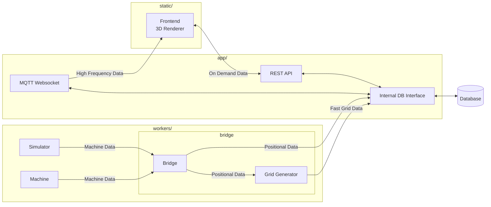

## Architecture [Graph](https://mermaid-js.github.io/mermaid/#/flowchart)

```mermaid
    flowchart LR
    subgraph static/
        FE[Frontend\n3D Renderer]
    end

    subgraph app/
        API[REST API]
        WS[MQTT Websocket]
        DBI[Internal DB Interface]
    end

    subgraph workers/
        subgraph bridge
            BI[Bridge]
            GR[Grid Generator]
        end
        SIM[Simulator]
        MA[Machine]
    end

    DB[(Database)]

    FE <-->|On Demand Data| API
    WS -->|High Frequency Data| FE

    API <--> DBI
    WS <--> DBI
    DBI <--> DB

    BI --> |Positional Data| DBI
    GR --> |Fast Grid Data| DBI
    BI --> |Positional Data| GR
    SIM --> |Machine Data| BI
    MA --> |Machine Data| BI
```